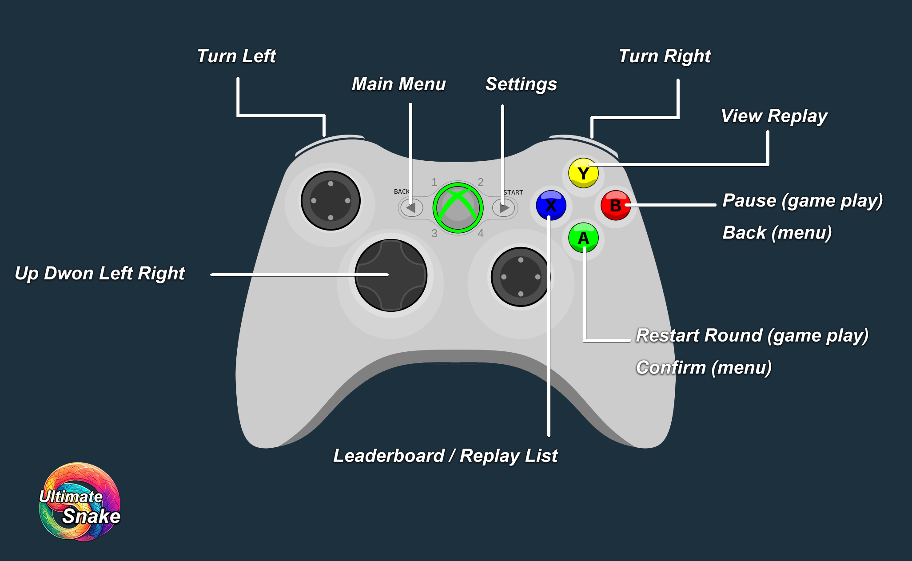
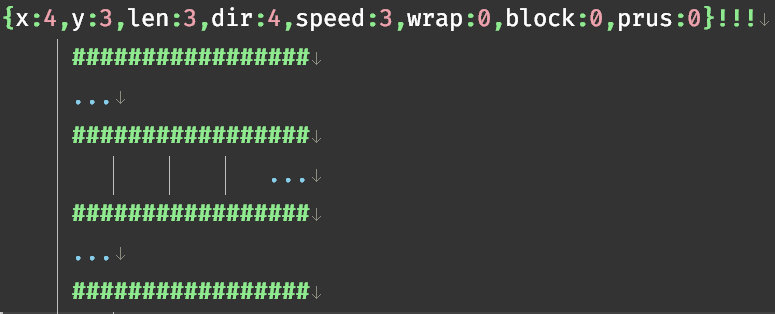

<head>
 <link rel="shortcut icon" type="image/x-icon" href="favicon.ico">
</head>

# Help
Snake game is a simple and addictive puzzle game where players control a continuously growing snake, eating food to increase its length while avoiding collisions with itself or the walls.

## Control
### Gamepad

### Keyboard / Mouse

|**Key**|**Function**|  
| :--- | :--- |  
|**↑↓←→**|move snake (4 directions mode).|  
|**←→**|move snake (2 directions mode).|  
|**Esc**|settings/back.|  
|**Space**|pause/restart.|  
|**F1**|leaderboard/replay list.|  
|**H**|main menu.|  

## Custom Level
### File Location
```text
<installation directory>/CustomLevel/<your files>.txt
```
### Format

|**Symbol**|**Implication**|  
| :--- | :--- |  
|**x,y**|the position of the snake's head (0 ≤ x ≤ 40, 0 ≤ y ≤ 28).|  
|**len**|the initial length of the snake.|  
|**speed**|the base speed of the snake.|  
|**wrap**|wrap mode (on/off).|  
|**block**|block mode (on/off).|  
|**prus**|pursuit mode (on/off).|  
|**#**|block.|  
|**.**|food.|   



## Theme
### File Location
```text
<installation directory>/res/themes.json
```

### Format
The theme file is in JSON.
```text
{
name1:[[front-color],[back-color]],
name2:[[front-color],[back-color]],
}
```
### example
```json
{
    "Black-Green": [[40, 60, 20, 255],[90, 140, 40, 255]],
    "Green-Black": [[90, 140, 40, 255], [40, 60, 20, 255]],
    "Black-White": [[50, 50, 50, 255], [200, 200, 200, 255]],
    "White-Black": [[200, 200, 200, 255], [50, 50, 50, 255]],
    "Theme1": [[25, 60, 50, 255], [25, 202, 173, 255]],
    "Theme2": [[60, 25, 50, 255], [244, 96, 108, 255]],
    "Theme3": [[150, 60, 40, 255], [236, 173, 158, 255]],
    "Theme4": [[40, 65, 75, 255], [190, 231, 233, 255]],
}
```
